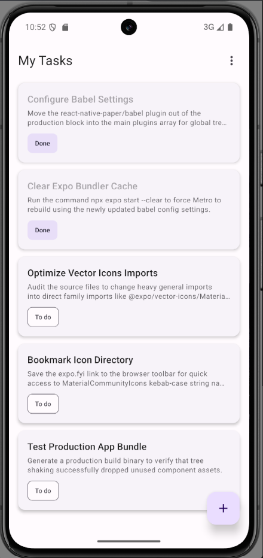
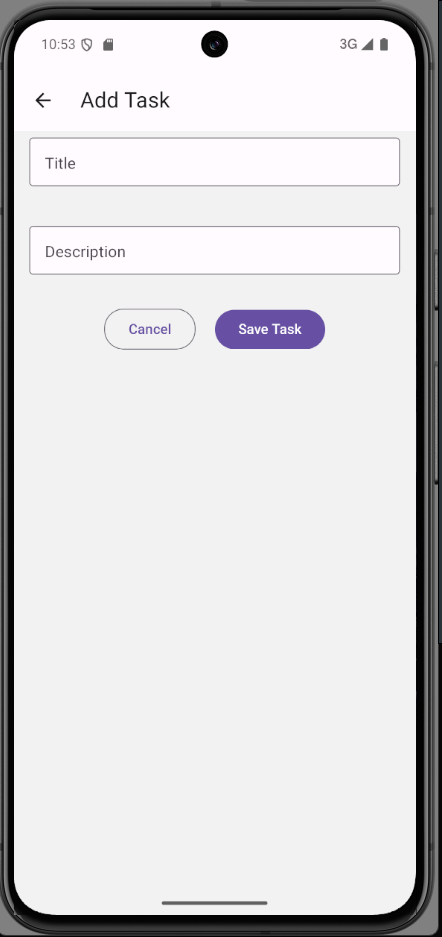
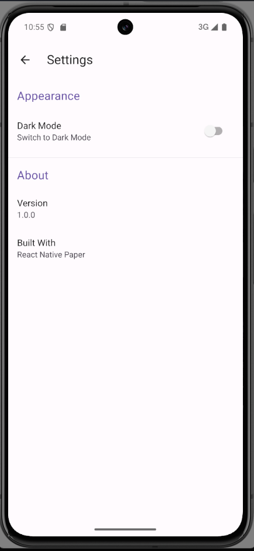
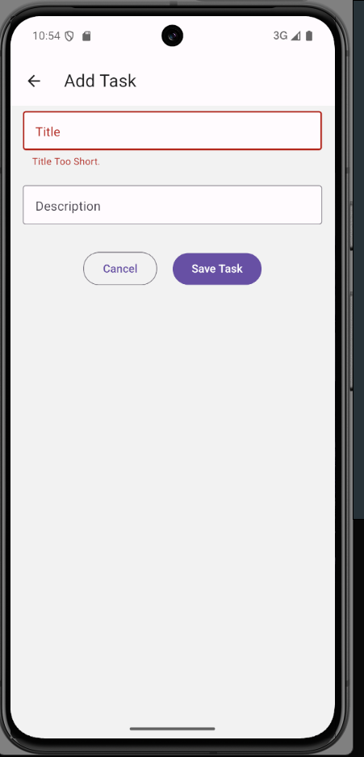
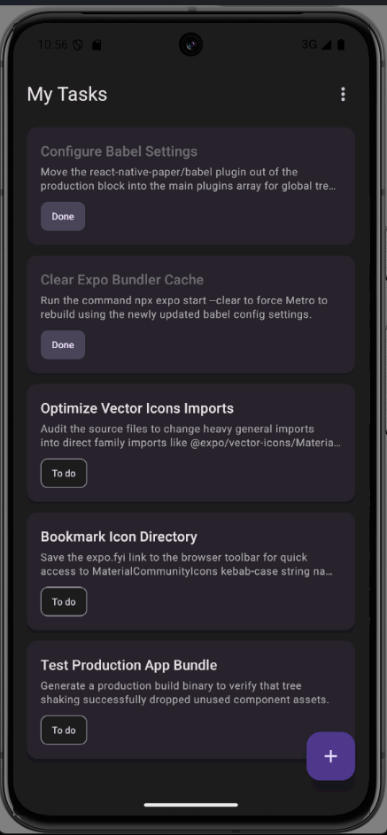
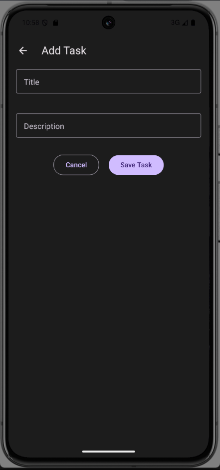
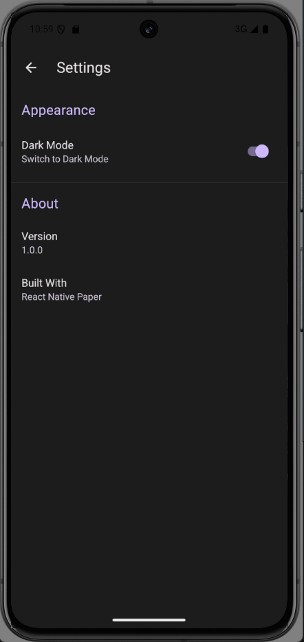
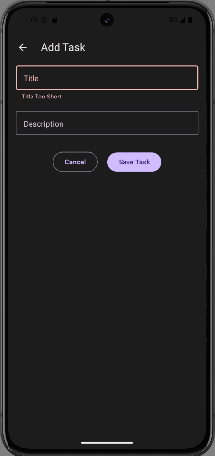

# React Native Paper Playground

A Task Listing project built with Expo and React Native Paper to explore Material Design components, theming, customization, and best practices for building modern mobile applications.

## Purpose

This project was built as an exploratory playground to understand React Native Paper, Material Design 3 principles, and how to build scalable theming systems in a React Native + Expo environment.

## Features

- Material Design 3 theming with light and dark mode support
- Scalable typography customization
- Snackbar notifications
- Reusable component architecture
- Redux-based state management

## Tech Stack

- React Native
- Expo
- React Native Paper — UI
- Expo Router — Navigation
- React Context — State Management

## Component Showcase

This project explores the following React Native Paper components:

- Appbar
- Buttons (contained, outlined)
- Chip
- Cards
- Menus
- FAB (Floating Action Button)
- Text
- Text Inputs
- HelperText
- Snackbars
- Switches
- Lists

## Project Architecture

```
src/
├── app/         # Expo Router routes
├── components/  # Reusable UI components
├── theme/       # Light/dark theme configuration
├── store/       # React Context setup
├── hooks/       # Custom React hooks
└── assets/      # Images and static files
```

## Getting Started

### Prerequisites

- Node.js 22+ (tested on Node 22)
- npm or pnpm
- Expo CLI
- Expo Go app (iOS / Android) — or an iOS Simulator / Android Emulator

### Installation

```bash
git clone git@github.com:Murimi254/react-native-paper-playground.git

cd react-native-paper-playground

npm install
```

### Run the Development Server

```bash
npm start
```

**On a physical device:** Scan the QR code with the Expo Go app.

**On an emulator/simulator:** Press `a` for Android or `i` for iOS in the terminal after the server starts.

## Live Demo

Prefer a video walkthrough? Watch the full demo here:

▶ https://youtu.be/FniPRDj7cg4

## Screenshots

### Light Theme

<p align="center">
  
  
  
  
</p>

### Dark Theme

<p align="center">
  
  
  
  
</p>

## Key Learnings

This project helped me learn:

- Designing a scalable theme system (light/dark + tokens)
- Structuring reusable UI components with React Native Paper
- Understanding Material Design 3 design patterns
- Managing UI consistency across screens

## License

MIT
